# 📚 Tugas Basis Data – Sistem Perpustakaan  
*(Tugas 1 & Tugas 2)*

## Identitas
- **Nama**        : Puspa Dwi Setyorini  
- **NIM**         : 60324003  
- **Mata Kuliah** : Pemrograman Website 2  
- **Semester**    : 4 (Empat)

---

## Deskripsi
Repository ini berisi implementasi database **Sistem Perpustakaan** yang mencakup:

- **Tugas 1**: Eksplorasi database menggunakan query SQL  
- **Tugas 2**: Desain database lengkap dengan relasi, foreign key, soft delete,
  stored procedure, dan ERD  

Seluruh query dijalankan menggunakan **phpMyAdmin** dan hasilnya
didokumentasikan dalam bentuk **screenshot**.

---

# 📝 TUGAS 1 – Eksplorasi Database dengan Query

## 1. Statistik Buku

### 1.1 Total buku seluruhnya
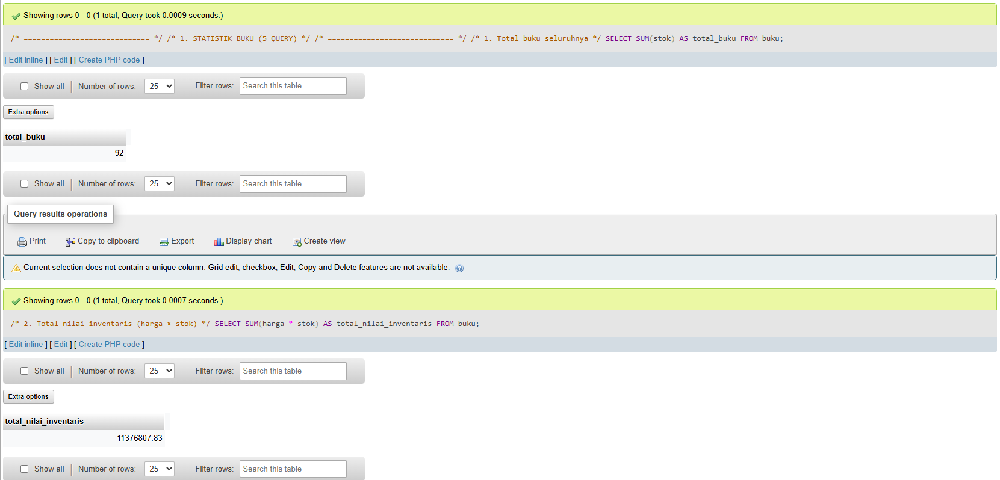

### 1.2 Total nilai inventaris (harga × stok)

### 1.3 Rata-rata harga buku
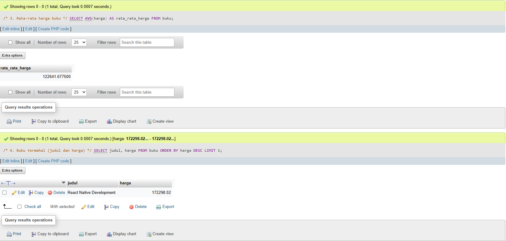

### 1.4 Buku termahal

### 1.5 Buku dengan stok terbanyak

---

## 2. Filter dan Pencarian

### 2.1 Buku kategori Programming dengan harga < 100.000

### 2.2 Buku dengan judul mengandung "PHP" atau "MySQL"

### 2.3 Buku yang terbit tahun 2024
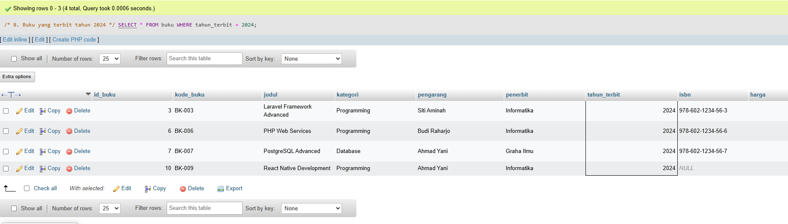

### 2.4 Buku dengan stok antara 5–10

### 2.5 Buku dengan pengarang "Budi Raharjo"

---

## 3. Grouping dan Agregasi

### 3.1 Jumlah buku dan total stok per kategori

### 3.2 Rata-rata harga buku per kategori

### 3.3 Kategori dengan total nilai inventaris terbesar
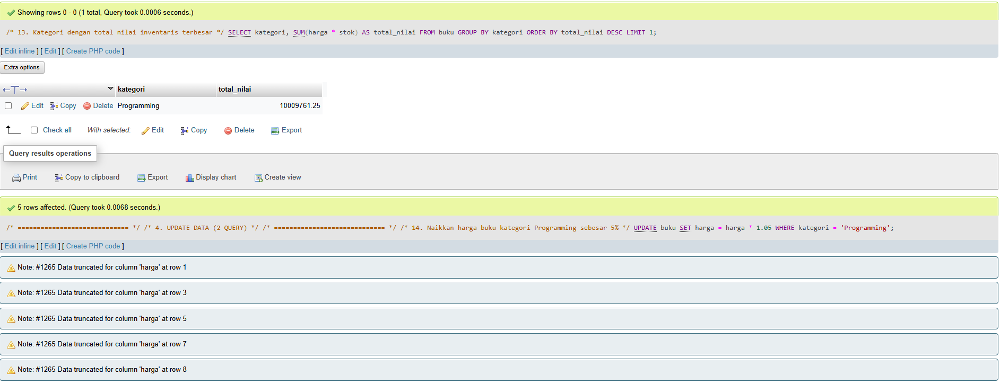

---

## 4. Update Data

### 4.1 Kenaikan harga buku kategori Programming sebesar 5%

### 4.2 Penambahan stok buku dengan stok < 5
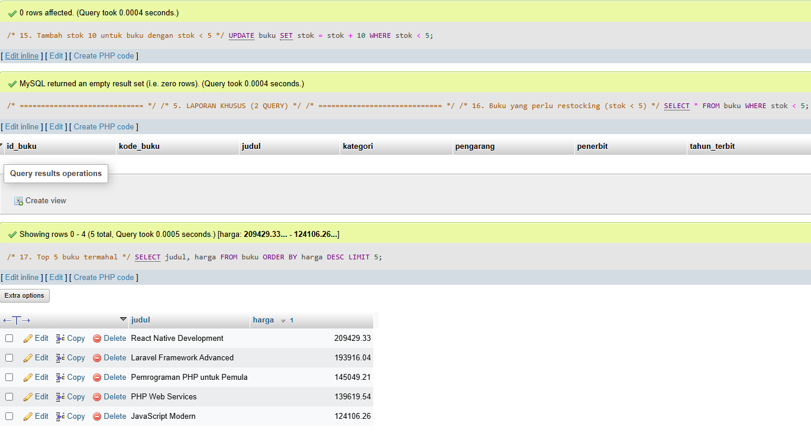

---

## 5. Laporan Khusus

### 5.1 Daftar buku yang perlu restocking (stok < 5)

### 5.2 Top 5 buku termahal

---

# 🗂️ TUGAS 2 – Desain Database

## 6. Struktur Database

### 6.1 Struktur Tabel Buku
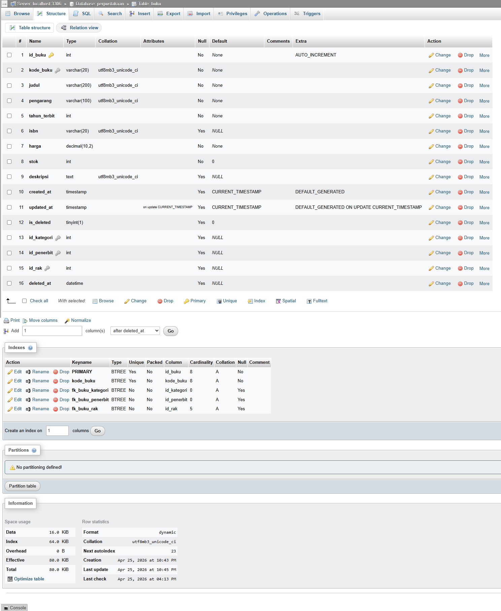

### 6.2 Struktur Tabel Kategori Buku
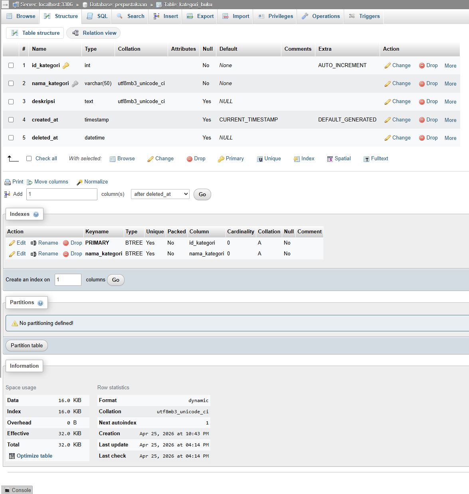

### 6.3 Struktur Tabel Penerbit
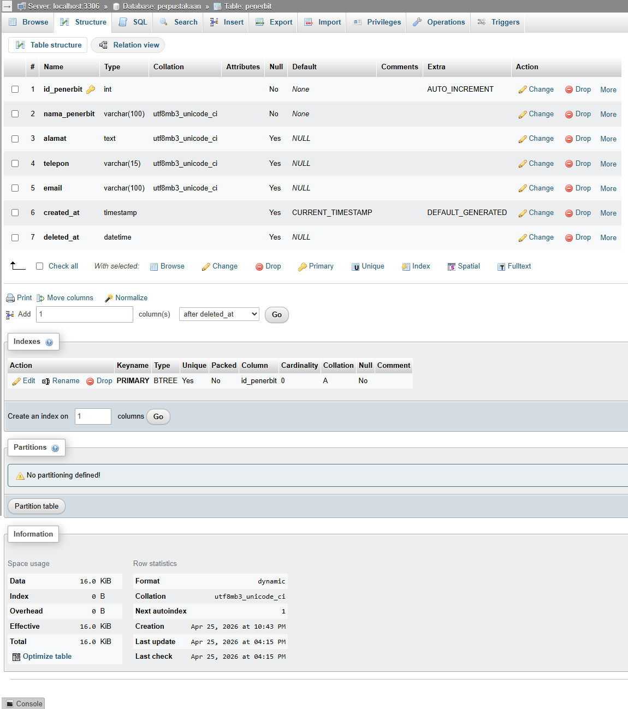

### 6.4 Struktur Tabel Rak
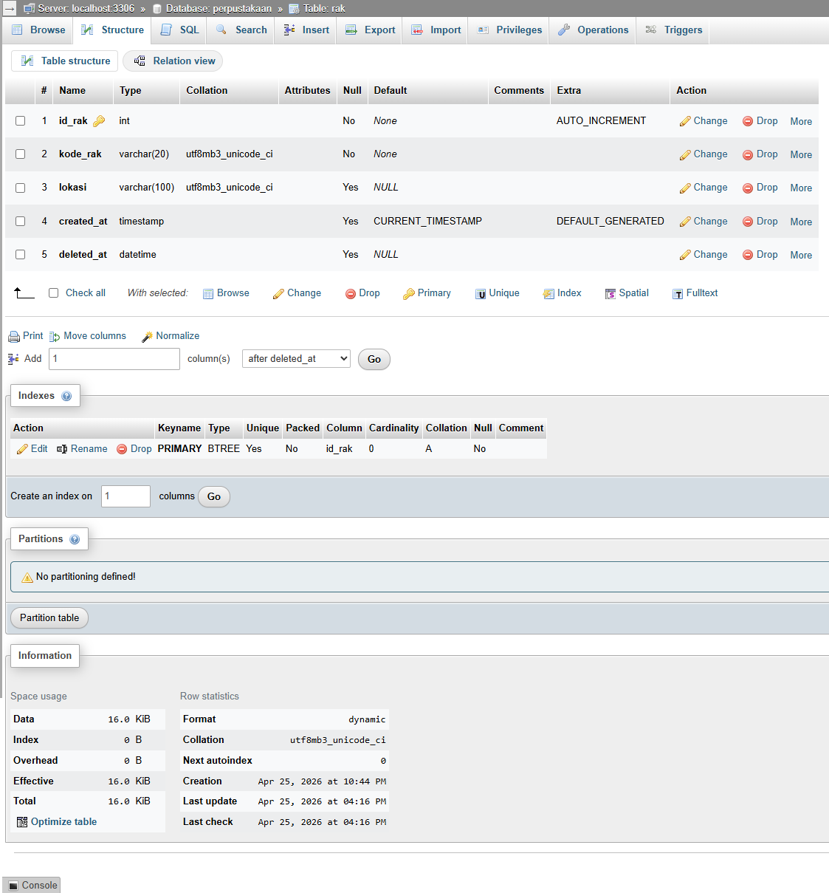

---

## 7. Data Awal Tabel

### 7.1 Data Tabel Buku
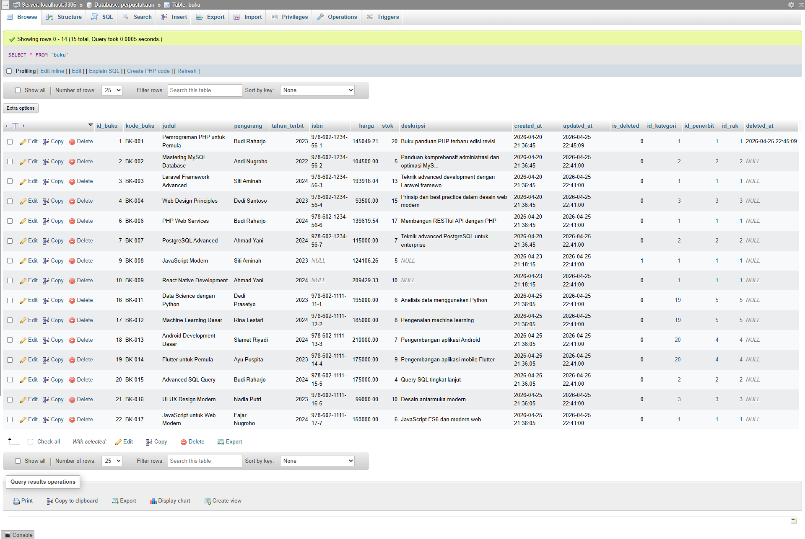

### 7.2 Data Tabel Kategori Buku
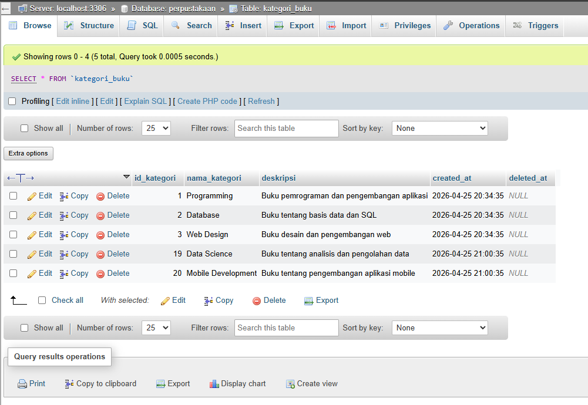

### 7.3 Data Tabel Penerbit
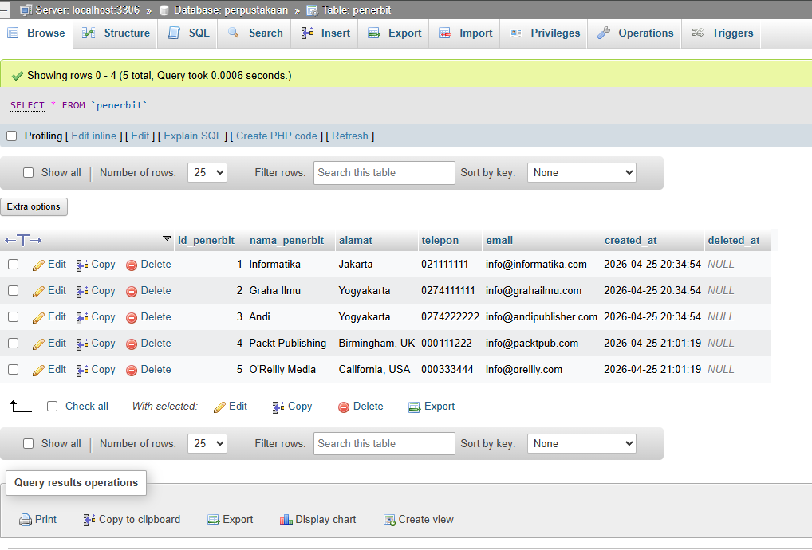

### 7.4 Data Tabel Rak
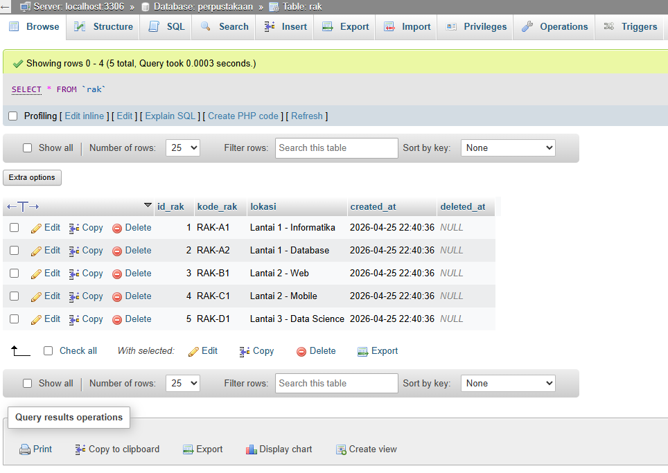

---

## 8. Relasi dan Query JOIN

### 8.1 Hasil JOIN Tabel Buku, Kategori, Penerbit, dan Rak
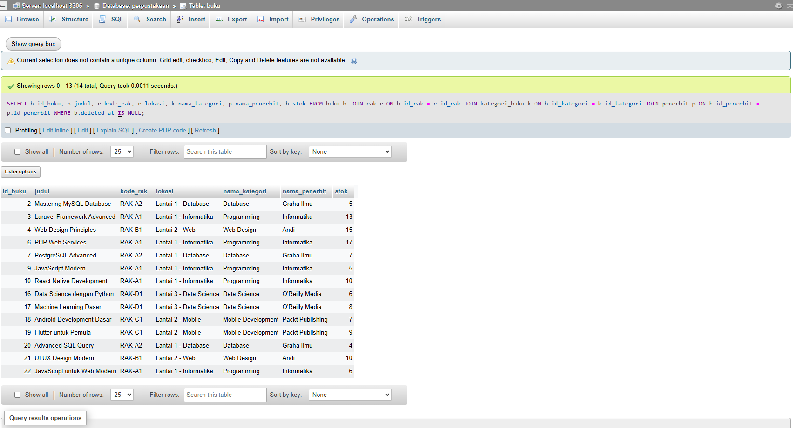

---

## 9. Stored Procedure

### 9.1 Stored Procedure Tambah Buku
Stored procedure digunakan untuk menambahkan data buku baru secara otomatis
dengan relasi ke kategori, penerbit, dan rak.

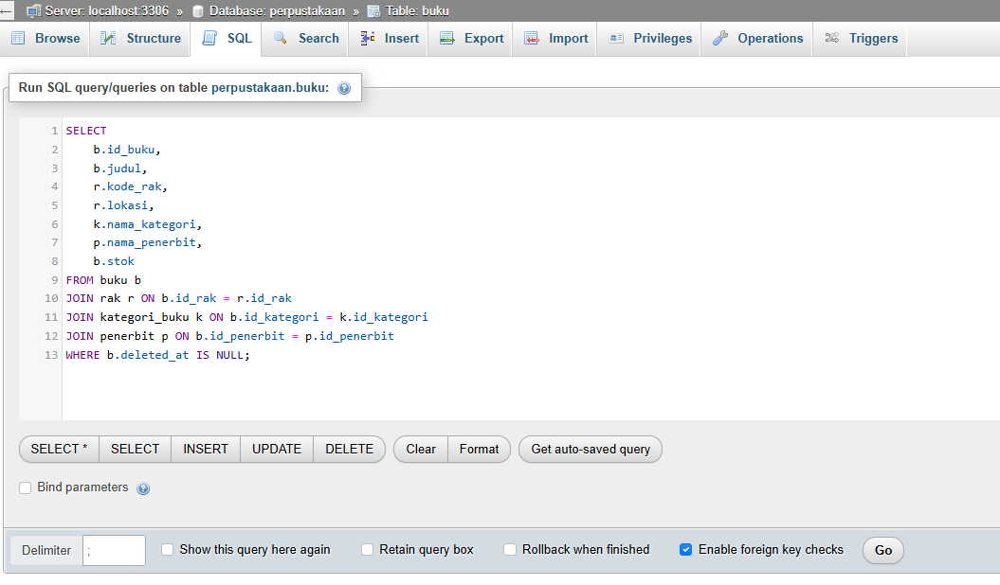

---

## 10. Entity Relationship Diagram (ERD)

### 10.1 ERD Database Perpustakaan
ERD menggambarkan hubungan antar tabel `buku`, `kategori_buku`,
`penerbit`, dan `rak` berdasarkan foreign key yang telah dibuat.

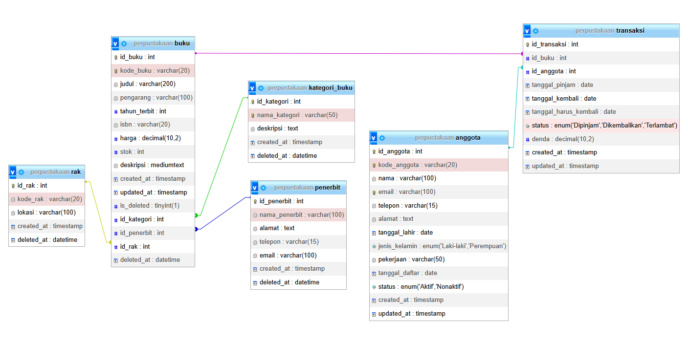

---

## Kesimpulan
Melalui pengerjaan Tugas 1 dan Tugas 2, database perpustakaan berhasil dirancang
dan dianalisis secara menyeluruh. Sistem ini telah menerapkan relasi antar tabel,
foreign key, soft delete, stored procedure, serta dokumentasi visual berupa ERD
untuk mendukung pengelolaan data yang terstruktur dan efisien.