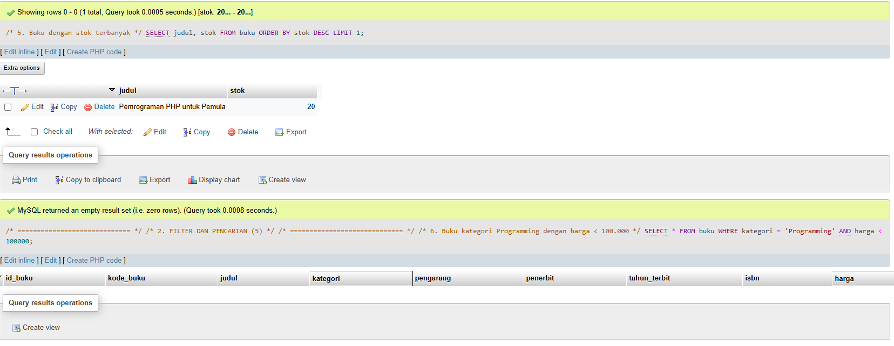
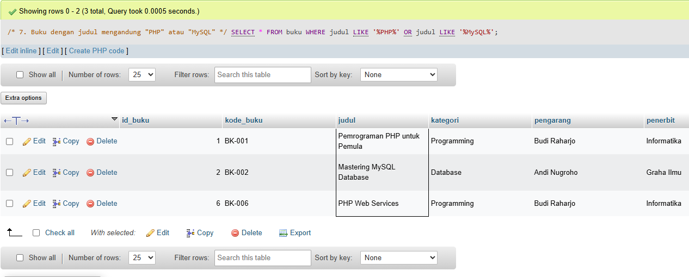
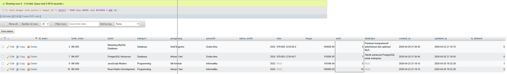
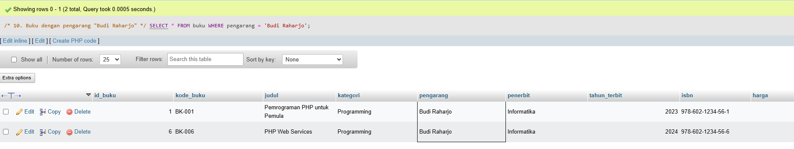
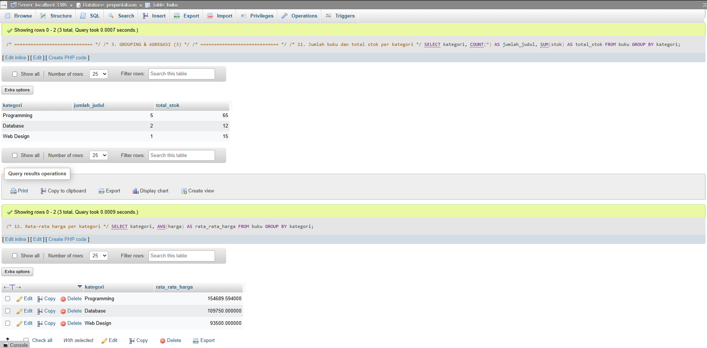

# Tugas 1 – Eksplorasi Database Perpustakaan

## Identitas
- Nama : Puspa Aja
- NIM  : (isi NIM kamu)
- Mata Kuliah : Basis Data

## Deskripsi
Repository ini berisi file query SQL (`query_tugas.sql`) yang digunakan untuk
melakukan eksplorasi database perpustakaan, meliputi statistik data, filter,
grouping, update data, dan laporan khusus.  
Setiap query dijalankan di phpMyAdmin dan hasilnya didokumentasikan dalam bentuk
screenshot.

---

## 1. Statistik Buku

### 1. Total Buku & Total Nilai Inventaris
Query untuk menghitung total buku dan total nilai inventaris.

### 2. Rata-rata Harga & Buku Termahal
Query untuk menghitung rata-rata harga buku dan menampilkan buku termahal.

### 3. Buku dengan Stok Terbanyak
Query untuk menampilkan buku dengan stok terbanyak.

---

## 2. Filter dan Pencarian

### 4. Buku Kategori Programming Harga < 100.000

### 5. Buku dengan Judul Mengandung PHP atau MySQL

### 6. Buku Terbit Tahun 2024

### 7. Buku dengan Stok antara 5 sampai 10

---

## 3. Grouping dan Agregasi

### 8. Jumlah Buku dan Total Stok per Kategori

### 9. Kategori dengan Total Nilai Inventaris Terbesar

---

## 4. Update Data dan Laporan Khusus

### 10. Update Harga dan Stok Buku
Query untuk menaikkan harga buku kategori Programming sebesar 5%
dan menambah stok buku yang stoknya kurang dari 5.

---

## Kesimpulan
Dengan menggunakan query SQL, data dalam database perpustakaan dapat dianalisis
dan dikelola dengan lebih mudah, mulai dari melihat statistik buku, melakukan
filter dan pencarian, hingga melakukan update data dan menentukan kebutuhan
restocking.